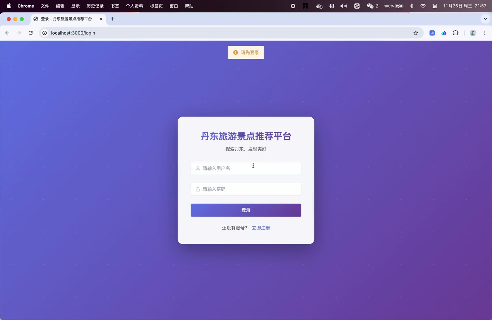
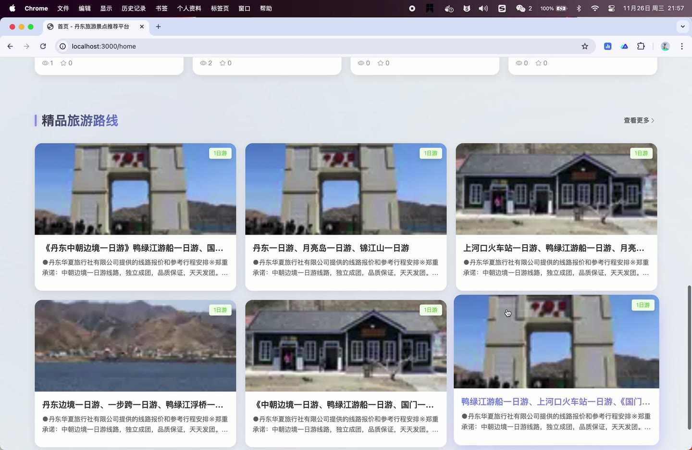
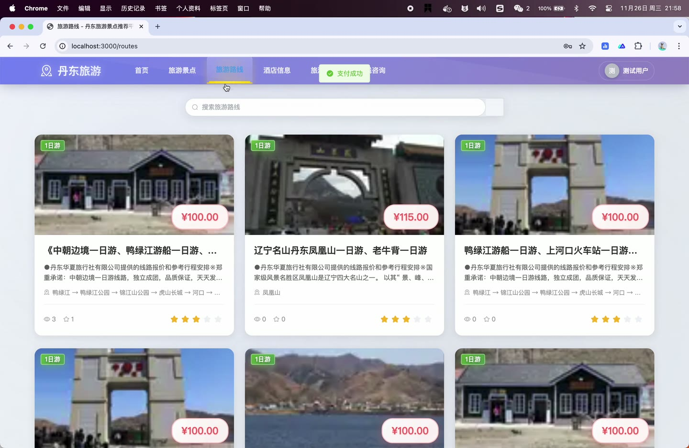
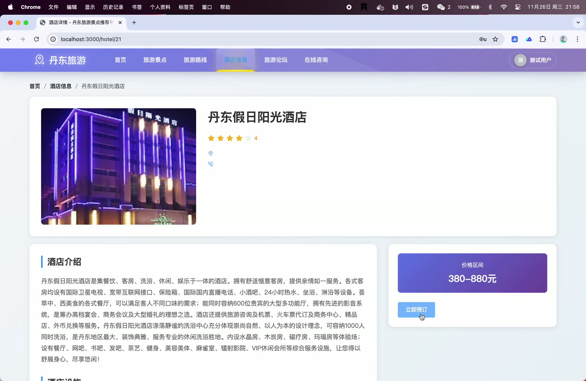

# (附文档)Python+Vue3+MySQL 丹东旅游景点推荐平台的设计与实现

**技术栈**：Python、Django、Vue3、MySQL

### 系统简介

本系统是基于 Python + Django + Vue3 开发的丹东旅游景点推荐平台，采用前后端分离架构，后端提供 REST 风格接口，前端使用 Vue3 单页应用。系统包含普通用户端与管理员端两类角色，覆盖景点浏览、路线推荐、酒店预订、门票下单、社区论坛、在线咨询与后台数据统计等完整业务闭环。
 
### 核心功能
 
### 普通用户端

 
- 用户注册：填写用户名、密码、确认密码、昵称、邮箱，校验用户名唯一性与两次密码一致性。 
- 用户登录：使用用户名与密码登录，登录成功后按角色自动跳转前台首页或后台首页。 
- 个人信息维护：在个人中心查看并修改昵称、头像、邮箱、手机号等资料。 
- 景点浏览：按景点类型筛选、按名称关键词搜索，分页查看景点列表。 
- 景点详情：查看景点封面、图片、描述、地址、所属区域、门票价格、开放时间、交通指南、联系电话与推荐等级，进入详情自动累加浏览次数。 
- 路线浏览与详情：分页查看旅游路线列表，查看路线名称、游玩天数、包含景点、参考价格与推荐等级，进入详情自动累加浏览次数。 
- 路线评论：对指定路线发表评论内容并给出评分。 
- 酒店浏览与详情：按名称搜索、分页查看酒店列表，查看酒店星级、设施、房型、价格区间、地址与联系电话。 
- 门票下单：选择景点、游玩日期与购票数量，填写联系人姓名、电话与备注，系统生成订单号并计算总价。 
- 门票订单操作：对待支付订单执行支付，对已支付订单执行取消或退款，对已支付订单执行核销使用。 
- 酒店下单：选择酒店、房型、入住日期、退房日期与房间数量，填写联系人信息，系统按入住天数计算总价。 
- 酒店订单操作：对待支付订单执行支付，对已支付订单执行入住、退房、退款或取消。 
- 我的订单：按用户 ID 查询本人门票订单与酒店订单列表。 
- 收藏管理：对景点、路线、酒店发起收藏，取消收藏，校验是否已收藏，并查看本人收藏列表。 
- 论坛发帖：发布帖子标题、内容与图片，帖子记录浏览次数、点赞次数与评论次数。 
- 论坛互动：浏览帖子列表与帖子详情，对帖子点赞，发表评论，查看帖子评论列表。 
- 在线咨询：提交咨询标题与内容，查看本人咨询记录及管理员回复内容。
 
### 管理员端

 
- 数据统计概览：查看平台总览数据，包括用户、订单、景点、论坛等维度的统计指标。 
- 订单统计：按订单维度统计数量与金额走势。 
- 用户统计：按用户维度统计注册与活跃情况。 
- 景点统计：统计景点浏览量、收藏量与订单热度。 
- 论坛统计：统计帖子发布量与互动情况。 
- 综合统计：汇总多维度指标形成综合报表。 
- 大数据分析：调用 Spark 大数据分析接口，展示用户增长趋势、订单趋势、热门景点 TOP10、热门酒店 TOP10、活跃用户 TOP20 与社区活跃度图表。 
- 用户管理：分页查询用户，按用户名或昵称关键词搜索，新增用户，编辑用户资料，逻辑删除用户。 
- 景点类型管理：分页查询景点类型，新增、编辑、删除类型，维护类型名称、描述与排序。 
- 景点管理：按类型与关键词筛选分页查询景点，新增、编辑、删除景点，维护封面、图片、描述、地址、区域、门票价格、开放时间、交通指南、电话、推荐等级与上下架状态。 
- 路线管理：分页查询路线，按名称搜索，新增、编辑、删除路线，维护封面、游玩天数、包含景点、参考价格、推荐等级与状态。 
- 酒店管理：分页查询酒店，按名称搜索，新增、编辑、删除酒店，维护封面、图片、描述、地址、区域、电话、星级、设施、房型与价格区间。 
- 门票订单管理：分页查询门票订单，查看订单号、用户、景点、游玩日期、数量、总价、状态与联系人信息。 
- 酒店订单管理：分页查询酒店订单，查看订单号、用户、酒店、房型、入住退房日期、天数、房间数、总价与状态。 
- 论坛帖子管理：分页查询帖子，查看帖子详情，删除违规帖子与评论。 
- 咨询管理：分页查询用户咨询，对咨询进行回复并记录回复时间与状态。 
- 轮播图管理：查询全部轮播图与分页列表，新增、编辑、删除轮播图，维护图片地址、标题、跳转链接、排序与启用状态。
 
### 技术栈

 后端框架Python + Django 接口风格Django 视图函数 + REST 风格路由 ORMDjango ORM（Q 查询、Count/Sum 聚合、Paginator 分页） 权限控制基于角色的路由守卫（普通用户 / 管理员），登录态存储于 localStorage 前端框架Vue3 + Element Plus 前端路由Vue Router（前台路由 + 后台管理路由 + 可视化大屏路由） 状态管理Pinia（userStore 管理用户信息） 构建工具Vite 图表可视化ECharts 数据库MySQL
 
### 交付内容

 
- 后端完整源码 
- 前端完整源码 
- 数据库初始化脚本 
- 万字文档

## 界面展示

---

## 获取完整源码 + 万字文档

本仓库为项目介绍页。**完整前后端源码、数据库初始化脚本、万字项目文档**，请加微信 `kangkangcode`，或访问 [codekk.top](http://codekk.top) 获取。

可作课程设计 / 毕业设计参考，支持远程部署调试。